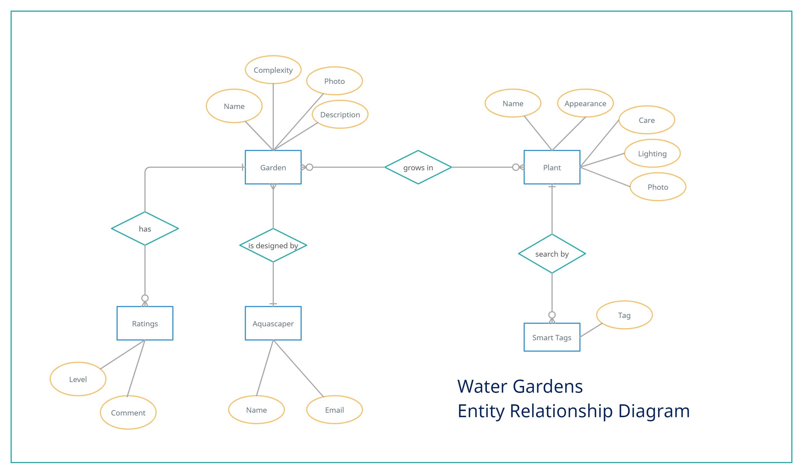
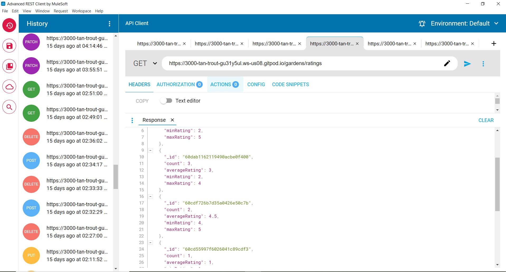

# Water Gardens Gallery - API Documentation

This is a backend server for the Water Gardens project. This is a demo project for educational purposes under the Trent Global College (Singapore).

Base URL for API: https://hh-tgc12p2-watergardens-be.herokuapp.com


## Objectives: 
To build the backend RESTFUL API services that connects to the Mongo database of the Water Gardens Gallery.

More details on the Water Gardens Gallery project can be found in the Front-End React repository.
https://github.com/haryati75/TGC-Project2-WaterGardensFE

## Main Technologies Used for Backend 
### 1. Database
### **Mongo DB on Atlas:**
* One-to-One (Garden-Aquascaper)
* One-to-Many (Garden-Ratings, Plant-SmartTags)
* **Many-to-Many** (Gardens-Plants)
    * Not included: validation of deletion of Plant done at Front-End (must not exist in any Garden document)
    * Not included: validation of insert of garden's plant done at Front-end (must exist in Plants collection)
* **CRUD** operations:
    * insertOne(), find(), findOne(), updateOne(), deleteOne()
* Queries with: 
    * $gte, $lt, $in, $nin, $or
* Queries with **Multi-Criteria, Projections, Sort, Limit** 
* **Arrays and Nested** sub-documents with CRUD and queries: 
    * $elemMatch, $regex, $push, $pull, $inc
* Mongo **Aggregate, Distinct, Count** operation used
* Aggregate operators: 
    * $sum, $avg, $min, $max, $unwind, $group

*Reference to MongoDB Manual (ver 4.4):
https://docs.mongodb.com/v4.4/introduction/*

### 2. Back-end
### **NodeJS and Express**
* Use of reusable module (wgUtil.js)
* API: **GET, POST, PUT, PATCH, DELETE** used
* validation of each API using try/catch
* use of **params, query and body** for API passing of parameters
* JSON format of data returns

### 3. Project and Development Sources
**GitHub, Gitpod** - use of GitHub repository for source codes and Gitpod for coding and testing.
Backend Server to be on **HEROKU**

https://github.com/haryati75/TGC-Project-2-Water-Gardens-BE

## Database ERD: water_gardens
The MongoDB database is called *water_gardens* made up of 2 collections:
* *gardens.garden*
    * aquascaper
    * ratings (Array of Objects)
    * plants (Array of Objects)
        * *id* is referenced to *aquatic_plants.plant._id*
* *aquatic_plants.plant*
    * smart tags (Array of Strings)

The database is hosted on Mongo DB Atlas cloud service.

The ERD diagram is as follows:


## RESTful APIs
The API calls for the backend service of Water Gardens Gallery are as follows: 

### 1. Get all gardens or plants
```
GET /gardens
GET /plants
```

### 2. Get a specific garden or plant
```
GET /garden/:id
GET /plant/:id
```
:id is garden._id / plant._id

### 3. Insert a new garden or plant
```
POST /garden/add
POST /plant/add
```
Parameters are passed using req.body (JSON format) for */garden/add*: 

```
{
    name,
    desc,
    completionDate,
    weeksToComplete,
    complexityLevel,
    aquascaper.name,
    aquascaper.email,
    photoURL
}
```
Parameters are passed using req.body (JSON) for */plant/add*: 

```
{
    name,
    appearance,
    care,
    lighting,
    likes, 
    photoURL
}
```
### 4. Delete an existing garden or plant
```
DELETE /garden/:id/delete
DELETE /plant/:id/delete
```
### 5. Update an existing garden or plant
```
PUT /garden/:id/edit
PUT /plant/:id/edit
```
Parameters are passed using req.body (JSON format) for */garden/:id/edit*: 

```
{
    name,
    desc,
    completionDate,
    weeksToComplete,
    complexityLevel,
    aquascaper.name,
    aquascaper.email,
    plants.id,
    plants.name,
    plants.care,
    plants.photoURL,
    ratings.level,
    ratings.comment,
    photoURL
}
```
Parameters are passed using req.body (JSON) for */plant/:id/edit*: 

```
{
    name,
    appearance,
    care,
    lighting,
    likes, 
    smartTags
    photoURL
}
```
### 6. Increase Plant Likes by 1
```
PATCH /plant/:id/likes/add_one
```
### 7. Filter Gardens and sort by Garden ID in descending order
```
GET /gardens/top

?n=<number of gardens to limit>
&rating=<+/-ratings.level>
&level=<complexityLevel>
&aquascaper=<aquascaper.name>
```

### 8. Filter Plants and sort by Plant ID in descending order
```
GET /plants/top

?n=<number of plants to limit>
&likes=<+/-likes>
&care=<care>
&lighting=<lighting>
```

### 9. Filter Top Aquascapers in Gardens
Has ratings with level 4 or 5, Complexity is Intermediate, Semi-Professional or Professional and Garden's Plants has no easy care
```
GET /aquascapers/top

?n=<number of aquascapers to limit>
```
### 9. Add a rating to a garden
```
PATCH /garden/:id/rating/add
{
    newRatingLevel,
    newRatingComment
}
```
### 10. Delete a rating from a garden
```
PATCH /garden/:gid/rating/:rid/delete
```
### 11. Edit a rating in a garden
```
PUT /garden/:gid/rating/:rid/edit
{
    level,
    comment
}
```
### 12. Advanced Search for Gardens
```
GET /gardens

?search=<keyword for generic search>
&name=<name>
&desc=<desc>
&complexity=<complexityLevel>
&aquascaper=<aquascaper.name>
```

### 13. Advanced Search for Plants
```
GET /plants

?search=<keyword for generic search>
&name=<name>
&appearance=<appearance>
&care=<care>
&lighting=lighting>
&smarttag=smartTags>
```
### 14. Stats for Gardens' Ratings
```
GET /gardens/ratings
```
### 15. Number of Gardens by Complexity Level
```
GET /gardens/count
```
### 16. Names of Aquascapers
```
GET /aquascapers/names
```
### 17. Number of Gardens by Aquascapers
```
GET /aquascapers/count
```
### 14. All keywords in Plants' Smart Tags
```
GET /plants/smarttags
```


## Testing
All the API routes are tested using Advanced Rest Client (ARC) by Mulesoft.


### Gitpod API URLs:
https://3000-tan-trout-gu31y5ul.ws-us08.gitpod.io

https://3000-tan-trout-gu31y5ul.ws-us09.gitpod.io 

### Test Case for Advanced Search on Plants
#### Filter on plants using GET via req.query parameter passing:
```
https://3000-tan-trout-gu31y5ul.ws-us08.gitpod.io/plants/top?n=5&care=easy&care=medium&lighting=moderate&likes=-10

or

GET ../plants/top?n=5&care=easy&care=medium&lighting=moderate&likes=-10
```
**Expected Output:** 
The above will return at most 5 plants documents in JSON format with care = easy/medium and has lighting = moderate/moderate-low/moderate-high and less than 10 likes

## Files Organisation

Main Source files with reusable codes:
1. **index.js** (all routes here)
2. **wgUtil.js** (error handling and array formatting)
3. MongoUtil.js (db connection)

Gitpod starting of server and connecting to DB on npm:
```
npm install -g nodemon
nodemon index.js
```
Environment variables: 
```
MONGO_URI in .env
```
.gitignore contains:
```
.env
node_modules
```

Dependencies: 
```
yarn add express
yarn add cors
yarn add mongodb
yarn add axios
yarn add dotenv
```

## Deployment
Sign up or login to Heroku. In Gitpod bash terminal: 
```
heroku login -i
heroku create <watergardens-be>
```
Procfile is created with the following entry:
```
web: node index.js
```
package.json is added with "start" in "scripts" as below:
```
 "scripts": {
    "test": "echo \"Error: no test specified\" && exit 1",
    "start": "node index.js"
  }
```
change port in app.listen in index.js as follows:
```
app.listen(process.env.PORT, ()=> {
    console.log("Server started...")
})
```
push to Heroku:
```
git add .
git commit -m "Deployment to Heroku"
git push heroku master
```
The backend server is hosted at heroku:
https://hh-tgc12p2-watergardens-be.herokuapp.com


